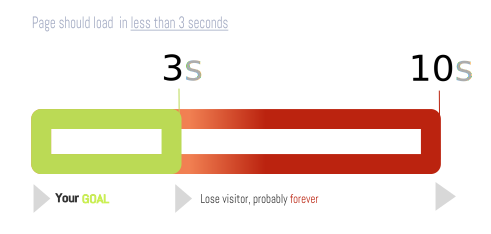

# Create a stunning, well performing and secure website

  A truly stunning website means, somebody has got all  elements of interaction play out to engage a conversation with user behaviour, leaving the intended perception, irrespective of the medium/device used. 

  Let me break this down. It's an attempt to provide a checklist of activities, tools, techniques, mechanics, tips and approach to make a stunning, secure and well performing website. 

  Who would not want it ?

# 5 Big Stories

  - [Interaction Design](#interaction-design-)
  - [Performance](#performance-)
  - [Security](#security-)
  - [SEO](#seo-)
  - [Reputation](#reputation-)		

## Story 1 - Interaction Design

## Story 2 - Performance

  - [Performance Mechanics 1 : Response Time](#performance-mechanics-1-response-time-)
   

## Story 3 - Security

## Story 4 - Reputation

## Story 5 - SEO

## Mechanics

### **Performance Mechanics 1** : Response Time

  Sites lose half their visitors while loading. Speed index determines how long it takes for the visible content of a webpage to appear. Any webpage that **fail to load within 3 seconds** are known to **lose visitors**.

  The research results are characterized as below

  | Response Time      | User Perception       | End Result |
  | ------------------ | --------------------- | ---------- |
  | 0.1 second         | Direct Control        | User feels full control as holding a tool in hand hence will let the visual manifestation happen.  |
  | 1 second           | Indirect Control      | User notices the delay but still feels in control over the site experience. |
  | 10 seconds         | Little Control        | The user loses attention and just moves on. Probably lost forever. |

#### **Peformance Goal 1** : Response Time

You need to **make your pages load in less than 3 seconds** for every user from anywhere every single time. 

# Further Reading

  Collection of resources and tools you could depend upon

  ## Tools

  -  Identify ways to make your site faster 
    	- https://testmysite.io/
    	- https://tools.monitorlive.co/
    	- https://developers.google.com/speed/pagespeed/insights/
		- https://www.webbloatscore.com/
    	- https://tools.pingdom.com/
    	- https://gtmetrix.com/
    	- https://www.webpagetest.org/

